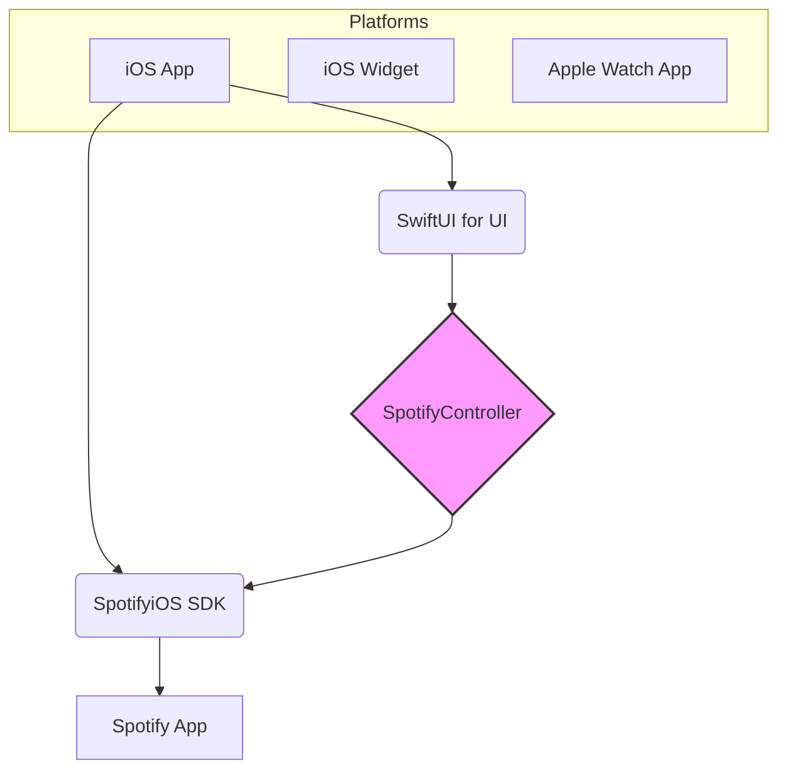

# NowPlaying

NowPlaying is a sleek and modern iOS application that displays the currently playing song from Spotify. It provides a beautiful, "glassmorphism" interface to view track details and control playback. The app also includes a widget and an Apple Watch companion app.

## Features

*   **Real-time Playback Info:** See the currently playing song's name, artist, and album art.
*   **Playback Control:** Play, pause, skip to the next or previous track, and skip 15 seconds forward or backward.
*   **Progress Bar:** View the current progress of the playing track.
*   **Beautiful UI:** A modern, translucent "glassmorphism" interface that uses the album art as a blurred background.
*   **iOS Widget:** (Planned) A home screen widget to see the now playing song at a glance.
*   **Apple Watch App:** (Planned) A companion app for your Apple Watch.

## Tech Stack

The application is built with modern Apple technologies.



*   **SwiftUI:** The entire UI for the iOS app, widget, and watch app is built using SwiftUI.
*   **SpotifyiOS SDK:** The app communicates with the Spotify app installed on the device using the official Spotify iOS SDK. This is used for authorization, fetching playback state, and controlling playback.
*   **Combine Framework:** Used for handling asynchronous events and data flow between the `SpotifyController` and the SwiftUI views.

## Project Structure

The project is a standard Xcode project with multiple targets:

```
NowPlaying/
├── Now Playing/          # Main iOS Application Target
│   ├── ContentView.swift # Main SwiftUI View
│   ├── SpotifyController.swift # Handles all communication with Spotify
│   └── ...
├── iOS Widget/           # iOS Widget Target
│   └── ...
└── Watch App Watch App/  # watchOS App Target
    └── ...
```

## Getting Started

1.  **Clone the repository:**
    ```bash
    git clone https://github.com/your-username/NowPlaying.git
    cd NowPlaying
    ```
2.  **Setup Spotify Developer App:**
    *   Go to the [Spotify Developer Dashboard](https://developer.spotify.com/dashboard).
    *   Create a new app.
    *   Get the `Client ID`.
    *   Edit Settings and add `spotify-ios-quick-start://spotify-login-callback` to the "Redirect URIs".
3.  **Configure Xcode Project:**
    *   Create a file named `Sample.xcconfig` in `Now Playing/Now Playing/`.
    *   Add your Spotify Client ID to the `Sample.xcconfig` file like this:
        ```
        SPOTIFY_API_CLIENT_ID = YOUR_CLIENT_ID
        ```
    *   In Xcode, go to the project settings, and under "Info" for the "Now Playing" target, add a "URL Types" entry. Set the "URL Schemes" to your app's scheme (e.g., `spotify-ios-quick-start`).
4.  **Open in Xcode and Run:**
    *   Open `Now Playing.xcodeproj` in Xcode.
    *   Select the "Now Playing" scheme and run on a simulator or a physical device with Spotify installed.

**Note:** You need to have the Spotify app installed and be logged in for NowPlaying to work.
